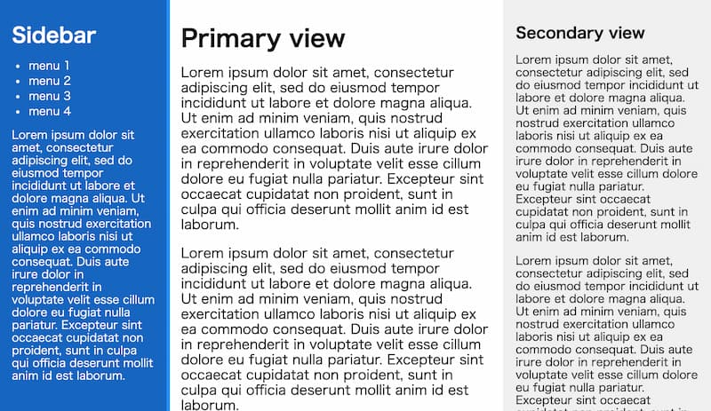

# react-sidebar-layout

* react-sidebar-layout provides components which enables 3-pain layout with resizable sidebars.

## Example

https://syumai.github.io/react-sidebar-layout-examples/basic/build/



## Installation

```
npm install --save @syumai/react-sidebar-layout
# or
yarn add @syumai/react-sidebar-layout
```

## Usage

* import SidebarLayout, Sidebar, PrimaryView, SecondaryView components from this package.
* Use it in your application like below.
  - Sidebar / PrimaryView / SecondaryView are just a container component which can contain any contents.

```tsx
import { PrimaryView, SecondaryView, Sidebar, SidebarLayout } from "react-sidebar-layout";

const SidebarContent = () => (
  <header><h1>Sidebar</h1></header>
);

const PrimaryViewContent = () => (
  <header><h1>Primary view</h1></header>
);

const SecondaryViewContent = () => (
  <header><h1>Secondary view</h1></header>
);

const App = (): JSX.Element => {
  return (
    <SidebarLayout defaultSidebarWidth={200} defaultSecondaryViewWidth={250}>
      <Sidebar><SidebarContent /></Sidebar>
      <PrimaryView><PrimaryViewContent /></PrimaryView>
      <SecondaryView><SecondaryViewContent /></SecondaryView>
    </SidebarLayout>
  );
};
```

### Properties

* Properties can be passed as attributes of `SidebarLayout`.

#### Sidebar widths

* `defaultSidebarWidth`: number (default: 200)
* `defaultSecondaryViewWidth`: number (default: 200)

#### Resizer styles

* `color`: string (default: transparent)
* `hoveredColor`: string (default: #1e90ff)
* `transitionDuration` (milli seconds): number (default: 300)
* `width` (px): number (defualt: 4)

### Customize Styles

* Components have its class name. Please write and attatch styles to its class name.
  - SidebarLayout: `.sidebar-layout`
  - Sidebar: `.sidebar-layout .sidebar`
  - PrimaryView: `.sidebar-layout .primary-view`
  - SecondaryView: `.sidebar-layout .secondary-view`

## Author

syumai

## License

MIT
